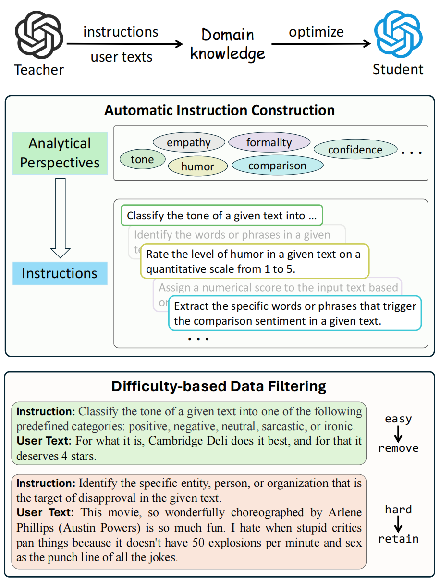

# CompEffDist: Comprehensive and Efficient Distillation for Lightweight Sentiment Analysis Models

This repository provides the official open-source implementation of the paper:

**Comprehensive and Efficient Distillation for Lightweight Sentiment Analysis Models** <i>Guangyu Xie#, Yice Zhang#, Jianzhu Bao, Qianlong Wang, Yang Sun, Bingbing Wang, Ruifeng Xu</i> [[EMNLP 2025]](https://aclanthology.org/2025.emnlp-main.1122/)


## Overview

We propose **CompEffDist**, a comprehensive and efficient distillation framework for sentiment analysis. It consists of two core modules:

* **Attribute-based Automatic Instruction Construction**: automatically builds diverse instruction sets from extracted attributes.
* **Difficulty-based Data Filtering**: prioritizes and samples training data by difficulty to improve efficiency.

Across multiple model families (**Llama-3**, **Qwen-3**, **Gemma-3**), our **3B** student models can match the performance of teacher models that are **~20× larger** on most tasks.
<p align="center">

</p>

---

## Released Training Corpus

Dataset: **`zhang-yice/sentiment-distillation-v2`**
Hugging Face: [https://huggingface.co/datasets/zhang-yice/sentiment-distillation-v2](https://huggingface.co/datasets/zhang-yice/sentiment-distillation-v2)

Included files:

* `Meta-Llama-3.1-70B-Instruct_50k.jsonl` — training data generated by Llama
* `Qwen3-32B_50k.jsonl` — training data generated by Qwen
* `gemma-3-27b-it_50k.jsonl` — training data generated by Gemma

---

## Released Distilled Models


| Model                                | Base Model          | Hugging Face                                                                                                                                     |
| ------------------------------------ | ------------------- | ------------------------------------------------------------------------------------------------------------------------------------------------ |
| llama-3-3B-sentiment-distillation-v2 | Llama-3-3B-Instruct | [https://huggingface.co/zhang-yice/llama-3-3B-sentiment-distillation-v2](https://huggingface.co/zhang-yice/llama-3-3B-sentiment-distillation-v2) |
| gemma-3-4b-sentiment-distillation-v2 | Gemma-3-4B-it       | [https://huggingface.co/zhang-yice/gemma-3-4b-sentiment-distillation-v2](https://huggingface.co/zhang-yice/gemma-3-4b-sentiment-distillation-v2) |
| Qwen3-4B-sentiment-distillation-v2   | Qwen3-4B-Instruct   | [https://huggingface.co/zhang-yice/Qwen3-4B-sentiment-distillation-v2](https://huggingface.co/zhang-yice/Qwen3-4B-sentiment-distillation-v2)     |

---

## Repository Structure

```text
.
├── 0_generate_attribute.py              # Steps 0–8: Attribute-based Automatic Instruction Construction
├── 1_extract_attributes.py
├── 2_generate_analysis_prompt.py
├── 3_extract_analysis_prompts.py
├── 4_task_specific_prompt_stage1.py
├── 5_task_specific_prompt_stage2.py
├── 6_extract_task_prompts.py
├── 7_task_specific_prompt_stage3.py
├── 8_task_specific_prompt_with_demos.py
├── clustering                           # Attribute clustering
│   ├── clustering.py
│   ├── collect_attr.py
│   ├── data
│   │   ├── clustering                   # Final clustering results
│   └── get_embedding.py                 
├── eval_sentibench                      # Sentibench evaluation code
├── machine_generated_instr              # Generated intermediate artifacts
│   └── 11_final_clusterid_2all_prompts.json   # All instructions generated from attribute clusters
├── post_train                           # Training scripts/configs
│   ├── bash
│   │   ├── llama_training.sh
│   │   └── model_name.json
│   ├── configs
│   │   └── 3b_full_config.yaml
│   └── training_data
├── prompts                              # User texts used for attribute extraction
├── requirements.txt                     # env
├── ranking_based_difficulty             # Difficulty-based data filtering
│   ├── difficulty_prioritized_sampling.py
│   └── rank_score_compute.py
└── utils.py
```

---

## Attribute-based Automatic Instruction Construction

### Step 1: Generate attributes

```bash
CUDA_VISIBLE_DEVICES=0,1,2,3 python 0_generate_attribute.py \
  -m /data/Meta-Llama-3.1-70B-Instruct \
  -z 100 -c 0.7 -g 4 \
  -i ./prompts/input_samples/sampled_amazon_input_4k.json__./prompts/input_samples/sampled_yelp_input_4k.json__./prompts/input_samples/sampled_movie_input_4k.json__./prompts/input_samples/sampled_tweet_input_4k.json__./prompts/input_samples/sampled_tweet_politics_input_4k.json \
  -o ./output_data/
```

### Step 2: Extract attributes

```bash
python 1_extract_attributes.py
```

### Step 3: Attribute clustering

Run the following scripts in order:

1. `collect_attr.py` — assign a unique ID to each attribute
2. `get_embedding.py` — compute/visualize embeddings
3. `clustering.py` — perform clustering

### Step 4: Generate instructions for analysis tasks

```bash
python 2_generate_analysis_prompt.py
```

### Step 5: Extract analysis-task instructions

```bash
python 3_extract_analysis_prompts.py
```

### Step 6: Generate multiple tasks per attribute cluster (task name + description)

```bash
python 4_task_specific_prompt_stage1.py
```

### Step 7: Expand task requirements into task-specific instructions

```bash
python 5_task_specific_prompt_stage2.py
```

### Step 8: Extract task-specific instructions

```bash
python 6_extract_task_prompts.py
```

### Step 9: Generate demos for each task using user-generated texts

```bash
python 7_task_specific_prompt_stage3.py
```

### Step 10: Extract demos and assemble final prompts

```bash
python 8_task_specific_prompt_with_demos.py
```

### Step 11: Final instruction collection

Final prompts for each attribute cluster are saved at:

* `./machine_generated_instr/11_final_clusterid_2all_prompts.json`

---

## Difficulty-based Data Filtering

* `./ranking_based_difficulty/rank_score_compute.py` — compute difficulty metrics
* `./ranking_based_difficulty/difficulty_prioritized_sampling.py` — stratified sampling based on difficulty

---

## Training and Evaluation

1. Download the training data from Hugging Face and place it under:

```text
./post_train/training_data
```

2. Start training:

```bash
cd post_train
bash llama_training.sh
```

Notes:

* Please edit `llama_training.sh` to match your environment (e.g., data paths, input/output column names).
* Also check `configs/3b_full_config.yaml` for training hyperparameters and runtime settings.

---

## Citation

```bibtex
@inproceedings{xie-etal-2025-comprehensive,
    title = "Comprehensive and Efficient Distillation for Lightweight Sentiment Analysis Models",
    author = "Xie, Guangyu  and
      Zhang, Yice  and
      Bao, Jianzhu  and
      Wang, Qianlong  and
      Sun, Yang  and
      Wang, Bingbing  and
      Xu, Ruifeng",
    editor = "Christodoulopoulos, Christos  and
      Chakraborty, Tanmoy  and
      Rose, Carolyn  and
      Peng, Violet",
    booktitle = "Proceedings of the 2025 Conference on Empirical Methods in Natural Language Processing",
    month = nov,
    year = "2025",
    address = "Suzhou, China",
    publisher = "Association for Computational Linguistics",
    url = "https://aclanthology.org/2025.emnlp-main.1122/",
    doi = "10.18653/v1/2025.emnlp-main.1122",
    pages = "22081--22102",
    ISBN = "979-8-89176-332-6",
}
```
